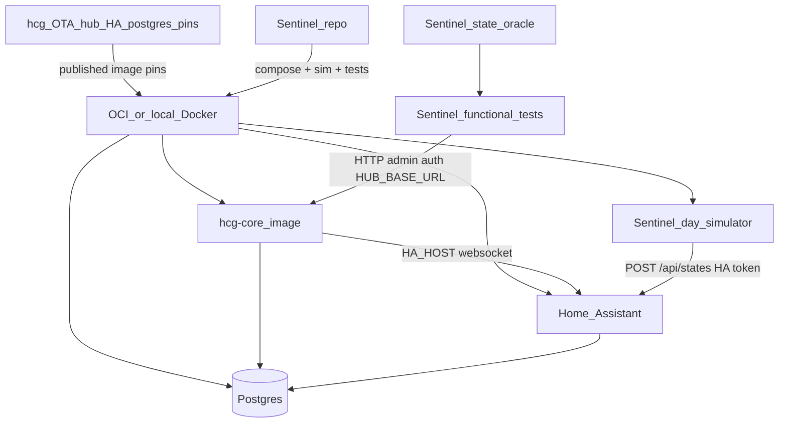

# Cloud-hosted Digital Twin testbed - build in Sentinel

## Repo decision

**Primary implementation: [`HomeCareGuardian/sentinel`](https://github.com/HomeCareGuardian/sentinel)** - black-box E2E / twin harness.

| Repo | Owns |
|------|------|
| **sentinel** | Twin compose, env/secrets, HA day-simulator, state oracle, functional API tests, OCI runbook, CI, `virtual-hub.sh` |
| **hcg** | Published images only. **No twin-specific hub code.** Hub, HA, and Postgres image pins ship via product OTA (multi-image OTA in progress). Sentinel deploys those same pins into the test env. |

### Operating model

1. **hcg** publishes `hcg-core` (and, as OTA lands, coordinated **HA** + **Postgres** pins in the OTA overlay / release).
2. **Test hub env (OCI or local)** pulls those images (`virtual-hub.sh deploy` / `up`).
3. **Sentinel** only wires the twin: compose, `targets.virtual-hub.env`, HA token, admin creds, scenarios, oracle, assertions against `HUB_BASE_URL`.
4. **No hcg inject API.** Motion and other sensors are written with **Home Assistant REST** `POST /api/states/{entity_id}` on the twin Docker network. The hub websocket path sees live `state_changed` as on a real Pi.

**Why not inject via hub `set_state`?** That route only allows actuation domains (`switch`, `light`, `number`, …). It 409s on `binary_sensor` / `sensor`. HA itself allows setting those states; the twin talks to HA, not to a new hub surface.

**Why not all in hcg?** Sentinel already owns black-box hub tests. The twin is test infrastructure.

## Twin topology (Phase 1)

| Component | Physical production | OCI / local Digital Twin |
|-----------|---------------------|---------------------------|
| Hardware | Raspberry Pi (ARM) | OCI Always Free (Ampere) or local Docker |
| Software | hcg-core + Zymkey + compose sidecars | Same **published** images; no Zymkey |
| Data ingestion | Real Zigbee → HA | Sentinel simulator → **HA REST** (private network) |
| Relay | GCP | None in Phase 1 |
| State storage | Postgres volume | Postgres volume in Sentinel compose |
| Updates | Field **OTA** (hub; HA + Postgres pins as OTA lands) | `virtual-hub.sh deploy` pulls the same image pins |

### Static twin principle

- Dedicated Sentinel compose stack - **no real sensors.**
- Customer Pi compose in `hcg` is unchanged.
- **No `HCG_VIRTUAL_HUB` feature flag** and **no hub inject endpoint.**
- HA port is **not** published publicly. Optional `127.0.0.1:8123` on the VM for operator debug. Caregiver/iOS still only hit hub APIs (relay allowlist unchanged).

## Target architecture



## Sentinel layout (Phase 1)

```
sentinel/
  docker-compose.virtual-hub.yml
  scripts/virtual-hub.sh              # up | down | status | deploy | wait-healthy | run-tests
  config/targets.virtual-hub.env.example
  virtual_hub/
    ha-config/                        # minimal HA config for the twin
    bootstrap_ha.py                   # onboard HA + long-lived token when needed
    simulator/
      day_runner.py
      ha_client.py
      casas_normaliser.py
      scenarios/
  oracle/v0/
  suites/functional/                  # pytest -m functional (Sentinel suite layout)
  docs/VIRTUAL_CUSTOMER_HUB.md
  docs/OCI_ALWAYS_FREE_RUNBOOK.md
```

## Ingestion pathway

1. **CASAS / synthetic normaliser** (Sentinel) → HA-shaped state payloads (`entity_id`, `state`, `attributes`).
2. **HA REST** `POST /api/states/{entity_id}` with long-lived token (Docker network only).
3. **Day simulator** - one synthetic day per wall-clock day; `--accelerated` for local/CI.

## Auth

| Caller | Auth |
|--------|------|
| Simulator → HA | HA long-lived access token (`HA_TOKEN`) |
| Functional tests → hub | Admin Basic auth (`ADMIN_USERNAME` / `ADMIN_PASSWORD`) |

Security: twin compose only; HA not on the public internet; OCI firewall allows hub API as needed for remote Sentinel runs.

## Image / OTA alignment

- Compose pins: `HCG_IMAGE`, `HOME_ASSISTANT_VERSION` (or `HOME_ASSISTANT_IMAGE`), `POSTGRES_IMAGE`.
- **hcg multi-image OTA (in progress)** will ship coordinated hub + HA + Postgres updates to field hubs.
- Twin `virtual-hub.sh deploy` pulls the **same pins** (manual / scripted until OTA targeting covers the twin VM, if ever).
- Phase 1 does not implement OTA agent logic in Sentinel; it only consumes published tags/digests.

## CI/CD (cost-aware)

| Gate | Where | What |
|------|-------|------|
| PR smoke | Sentinel Actions | Optional path filter; prefer `workflow_dispatch` ephemeral compose |
| Always-on twin | OCI VM | `virtual-hub.sh up`; cron simulator + functional suite |
| Release gating | `workflow_dispatch` against standing `HUB_BASE_URL` | |
| hcg PRs | Unchanged | No multi-day twin on every hcg PR |

## Phase 1 checklist

- [ ] `docker-compose.virtual-hub.yml` + `scripts/virtual-hub.sh`
- [ ] HA bootstrap + day simulator (HA REST inject)
- [ ] `oracle/v0/` fixtures
- [ ] `suites/functional/`
- [ ] `docs/VIRTUAL_CUSTOMER_HUB.md` + OCI runbook
- [ ] CI `workflow_dispatch` smoke
- [ ] **No hcg companion PR**

## Phase 2

- Claim twin to staging relay for `/api/app/*`.
- Richer CASAS oracle with pinned ML artefacts.
- Optional: twin VM consumes the same OTA channel as field hubs once multi-image OTA is live.

## Non-goals (Phase 1)

- Hub inject API or `HCG_VIRTUAL_HUB` flag.
- Simulation code inside `hcg-core/`.
- Relay on OCI.
- Relay training-sample ingest as sensor replay.

## Success criteria

- `virtual-hub.sh up` yields healthy hub + HA + Postgres with no Pi / Zigbee.
- Simulator motion appears on hub `GET /api/states`.
- `pytest -m functional` fails on covered API regressions.
- Docs describe OCI daily cron and multi-image pin updates.
- Founder Pi `pr-gate-hub` unchanged; virtual-hub is an extra profile.

## Implementation note

Execute in **this** Sentinel worktree. Paths:

- `docs/plans/virtual-customer-hub-phase1.md` (this file)
- `.cursor/plans/virtual_hub_e2e.plan.md` (optional Cursor mirror)
